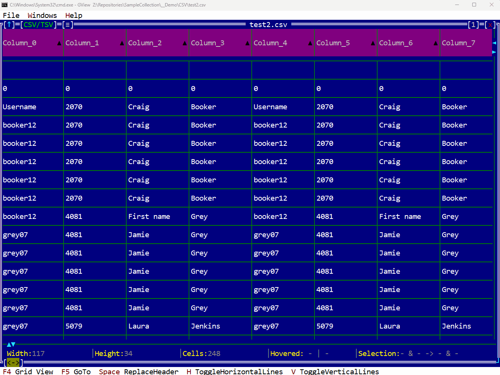

# GView


- [GView](#gview)
	- [General description](#general-description)
	- [Smart Viewers](#smart-viewers)
		- [Buffer Viewer](#buffer-viewer)
		- [Text Viewer](#text-viewer)
		- [Lexical Viewer](#lexical-viewer)
		- [Image Viewer](#image-viewer)
		- [Table Viewer](#table-viewer)
		- [Dissasm Viewer](#dissasm-viewer)
		- [Container Viewer](#container-viewer)
	- [Data Identifier Plugins](#data-identifier-plugins)
	- [Architecture](#architecture)
	- [Building](#building)
		- [Tools used](#tools-used)
		- [Supported platforms](#supported-platforms)
			- [Windows](#windows)
			- [OSX](#osx)
			- [Linux (Intel)](#linux-intel)
			- [Linux (ARM (M1))](#linux-arm-m1)
	- [CI/CD](#cicd)
	- [Documentation](#documentation)
	- [First run](#first-run)
		- [Windows](#windows-1)
		- [Linux](#linux)
		- [MacOS / OSX](#macos--osx)
	- [Start contributing](#start-contributing)

## General description 
**GView** framework is a powerful tool for examining files or any data with a defined structure, such as buffers or memory zones. Users can leverage the diverse range of available visualization options to effectively analyze and interpret the information.

On the other hand, from the perspective of developers, **GView** offers a flexible platform to create plugins that can parse various data structures. Developers can harness this capability to develop customized views and enhance the analysis capabilities of **GView**. By creating plugins, developers can extend the framework's functionality and tailor it to specific data formats or requirements, enabling more efficient and insightful data analysis.

## Smart Viewers

**Smart viewers** are software components designed to display data in various formats or representations. In the context of a **data identifier plugin**, multiple smart viewers are usually available, with one being designated as the primary viewer. This setup allows users to effortlessly switch between different viewers, selecting the visualization method that most effectively meets their specific needs.

### Buffer Viewer

Interprets data as a binary buffer and possesses the ability to identify and highlight specific portions of the buffer using various specifications such as regular expressions, offsets, content patterns, and more. It can effectively detect and highlight strings in both ASCII and Unicode formats. Additionally, the view is equipped with the capability to adjust code pages, enabling the clear representation of characters from diverse languages.


### Text Viewer
Interprets data as a sequence of characters arranged in lines, each separated by an identifier. It offers comprehensive support for various line separators, including CR, LF, CRLF, and LFCR. The view also provides flexible options for alignment, allowing different interpretations of the TAB character, and offers customizable wrapping settings for each line.


### Lexical Viewer
This viewer leverages the lexer provided by the **data identifier plugin**. It offers advanced functionalities such as displaying text with highlighted colors, enabling the folding or collapsing of code blocks, and incorporating diverse refactoring operations like variable and function renaming. Additionally, a data identification plugin can provide a range of language-specific transformations that can be applied to the text.


### Image Viewer
Visualize graphical representation of different image formats.


### Table Viewer
Represents data that has a tabelar format in an organized manner (CSV, TSV, SQL databases).



### Dissasm Viewer
Presents the content of binary files through a disassembly process that examines the code and deduces relevant details like imported function names, parameter names, and string pointers. This disassembly process relies on the Capstone library. In addition, the **data identifier plugin** plays a crucial role by providing essential information such as the required decoding method (e.g., x86, x64) and the code's entrypoint offset.


### Container Viewer
The viewer displays a range of components that can be extracted using the current **data identifier plugin**. This versatile functionality can be applied in various scenarios, such as extracting files from an archive or extracting streams from a PCAP file.


## Data Identifier Plugins

In the context of data analysis, a **data identifier plugin** serves as a valuable component capable of examining a buffer, whether in its binary form or translated into a textual representation. Its primary function is to automatically extract relevant and specific information from the buffer based on its type. To facilitate a comprehensive analysis, each data identifier plugin is equipped with dedicated panels designed to display detailed information specific to the identified data type.

| Plugin name | Data Type | Capabilities |
| ----------- | --------- | ------------ |
| BMP         | BMP (Bitmap) format is a widely used file format for storing raster graphics images | Open and view BMP files, providing a graphical representation of the image contained within the file |
| CPP         | CPP files are files with the .cpp file extension, which indicates that they contain C++ source code | Parse .cpp files, remove comments |
| CSV         | CSV and TSV files are both common file formats used for storing and organizing tabular data. | Parse .csv or .tsv files, sort columns, resize table, multiple selection, copy & paste |
| ELF         | ELF (Executable and Linkable Format) files are a standard file format used in many Unix-like operating systems, including Linux | Parse ELF formats (including detailed information about binaries built from GO language), highlight opcodes, extract sections, segments, symbols (static & dynamic) |
| ICO         | ICO (Icon) files are image files used to represent icons in Windows operating systems | Open and view ICO files, providing a graphical representation of the image(s) contained within the file |
| INI         | INI files are plain text files with a simple structure consisting of sections, keys, and values | Parse .ini files (TOML), remove comments |
| ISO         | ISO (International Organization for Standardization) files are archive files that contain an exact copy or image of a CD, DVD, or Blu-ray disc | Parse ISO files (ECMA 119) building a navigable tree from their content |
| JOB         |JOB files are associated with Task Scheduler, a built-in Windows utility that allows users to schedule and automate tasks on their system. These .job files are binary files that store the configuration and settings for a scheduled task created using Task Scheduler | Parse .job files, highlight each component |
| JS          | A .js file is a file that contains JavaScript code | Parse .js files, remove comments, const propagation, reverse strings. Work in progress. |
| JSON        | A JSON (JavaScript Object Notation) file is a file format used to store and exchange structured data in a lightweight and human-readable manner | Parse .json files, converts all keys to uppercase  |
| JT          | Jupiter Tessellation (JT) is a 3D data format which corresponds to ISO 14306:2012 standard | Parse .jt files, highlight each component |
| LNK         | A .lnk file, also known as a Windows Shortcut file, is a file type used in the Windows operating system to create shortcuts to files, folders, programs, or specific locations within the system | Parse .lnk file, extract all available data (detailed "ExtraData", "LinkTargetIDList" and "LocationInformation"), highlight components |
| MACHO       | Mach-O (Mach Object) and Mach-O Fat files are file formats used primarily in macOS and iOS systems for executable and object code | Parse Mach-O and Mach-O Fat formats (including detailed information about binaries built from GO language), highlight opcodes, extract sections, segments, symbols (static & dynamic), including validation of digital signature (hashes created on the sections binary) |
| PREFETCH    | Prefetch files contain metadata and information about the program's file access patterns and dependencies. They include details such as the program's executable file name, related DLL (Dynamic Link Library) files, and the order in which files are accessed during program execution | Parse Prefetch files extracting in an organized manner all the available data (paths, volumes, dependencies) |
| MAM         | MAM files are Prefetch files stored in a compressed form | Decompresses MAM files |
| PCAP        | PCAP (Packet Capture) files, also known as pcap files, are a common file format used for capturing and storing network packet data | Support built for HTTP streams (more to follow) |
| PE          | PE (Portable Executable) files are a file format used by Windows operating systems for executable programs, DLL (Dynamic Link Library) files, and other system components | Parse PE format (including detailed information about binaries built from GO language), highlight opcodes, extract sections, segments, symbols (static & dynamic), including validation of digital signature (CRL revocation on Windows or OpenSSL manual parsing & validation on Unix systems) |
| PYEXTRACTOR | PyInstaller combines a Python application and its associated dependencies into a unified package, enabling the execution of the packaged application without the need for a separate Python interpreter or individual module installations | Extract the PyInstaller-generated package of the bundled Python application and its dependencies from the packaged format (ELF, Mach-O, PE) |
| VBA         | VBA (Visual Basic for Applications) format refers to the file format used to store VBA code modules and associated macros within Microsoft Office documents, such as Excel workbooks, Word documents, PowerPoint presentations, and Access databases | Parse .VB (Visual Basic) files. Work in progress. |
| ZIP         | ZIP is a widely used file compression and archival format | Parse .zip files building a navigable tree from their content |

## Architecture

The architecture flow can be summarized as it follows:
1. Determine whether the content is binary or textual in nature. In the case of textual content, make an attempt to identify the encoding and decode it into a standardized format such as UTF-16.

2. Explore all available **data identifier plugins** to locate one capable of interpreting the given data. If no specific plugin is found, fallback to a generic plugin that solely distinguishes between binary and textual files.

3. The **data identifier plugin** selects suitable smart viewers tailored to the current data. Users have the flexibility to switch between these plugins and employ them to extract artifacts or data from the existing content.

4. Repeat steps 1 to 3 for the extracted components. This iterative process relies on artifacts obtained in previous steps to drive subsequent analysis and extraction.

As for the actual code components involved in the project, here are a high level view and a core view:


## Building
### Tools used
CMake is used to build the entire project regardless of the platform.README.md
Usage of [vcpkg](https://github.com/microsoft/vcpkg) in our build pipeline can be seen [here](/.github/workflows/ci.yml).
### Supported platforms
#### Windows
Works out of the box using [vcpkg](https://github.com/microsoft/vcpkg).                                                  
#### OSX
We are using [vcpkg](https://github.com/microsoft/vcpkg). It requires [curl](https://curl.se) installation.

Unfortunately, some vcpkg ports require manual installation via [brew package manager](https://brew.sh) of [pkg-config](https://formulae.brew.sh/formula/pkg-config) before building the project.
#### Linux (Intel)
Requires pkg-config package.

Works using [vcpkg](https://github.com/microsoft/vcpkg) and [curl](https://curl.se) (for vcpkg).

#### Linux (ARM (M1))
Requires pkg-config package.

Uncomment this line in top level CMakeLists.txt for Linux ARM architectures.

This will require manual installation of ninja (ninja-build).
```
# set(ENV{VCPKG_FORCE_SYSTEM_BINARIES} 1)
```
## CI/CD
At the moment we are using `Github Actions` ensuring that the project builds on `Windows`, `OSX` & `Linux` and we are working towards creating artefacts, storing them and eventually building a release flow.
For static analysis, we are using `CodeQL` & `Microsoft C++ Code Analysis`.

## Documentation 
The project uses Sphinx as the main documentation engine. Sphinx sources can be located under `docs` folder.

On every commit to `main`, a compiled version of the Sphinx documentation is published to `gh-pages` and then to docs.

## First run

There's currently a pre-release/beta GitHub CI/CD pipeline that creates an archive for each supported operating system.
It can be downloaded and the package can be run (via main binary - `GView` - but there's a catch depending on the platform).
The supported process architecture (via GitHub Actions) is Intel but it can be built for ARM as well.

### Windows

Runs out of the box (tested on Windows 10 x64), just unzip the release archive and run `GView.exe`.

### Linux

Ubuntu 18.04 is [deprecated](https://github.blog/changelog/2022-08-09-github-actions-the-ubuntu-18-04-actions-runner-image-is-being-deprecated-and-will-be-removed-by-12-1-22) in GitHub actions. Our precompiled binaries doesn't work there (GLIBC version is too old).

We are currently building on Ubuntu 20.04 (Intel) and this allows us to run `GView` on Ubuntu 20.04 and Ubuntu 22.04.

### MacOS / OSX

You'll get this warning for each GView binary from the package you're downloading:
```
macOS cannot verify that this app is free from malware.
Chrome downloaded this file today at 22:31.
```
Unfortunately, unless you entirely temporarely disable `Gatekeeper` (which would put your computer to a risk) you need to manually allow all the binaries, one by one, to run. This process cannot be avoided until we digitally sign the binaries (MacOS signing and notarization). 

## Start contributing
- Clone this repository using recurse submodules: 
```bash
	git clone --recurse-submodules <your-repo-link/GView.git>
```

Contributors can install sphinx using `pip install -r requirements.txt`, this will install Sphinx tooling and `sphinx_rtd_theme`. Local building is done with `make html`

After the command executes successfully, the html pages can be found in the `build` folder.
