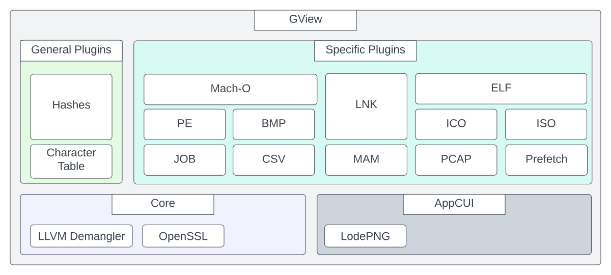
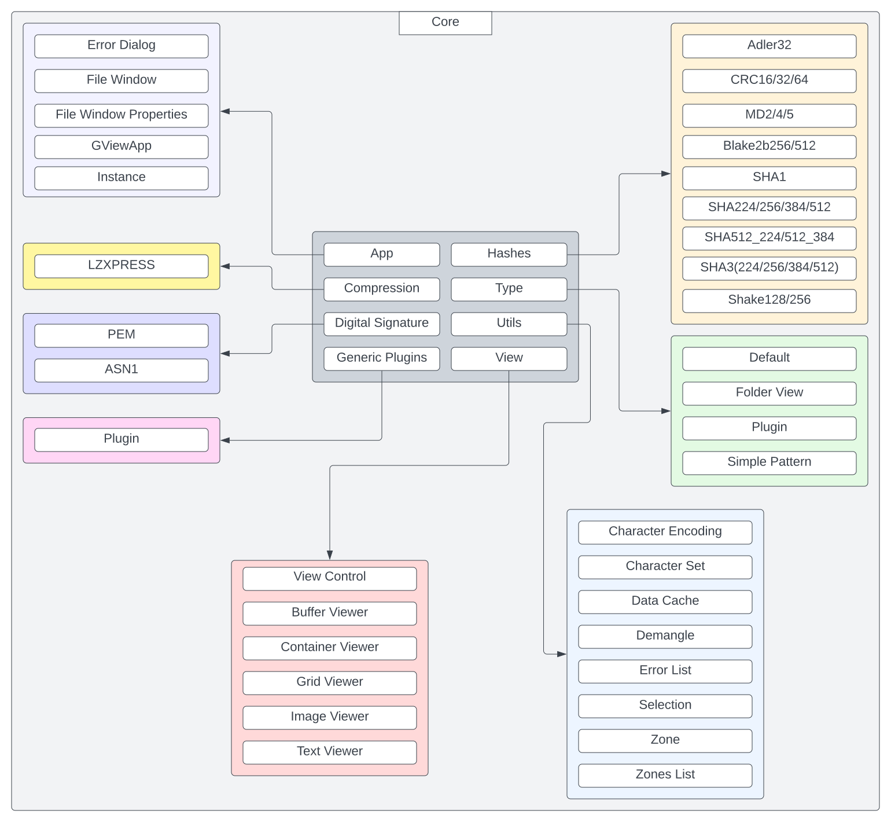

GView architecture
==================

Architecture flow
-----------------

1. **Content type** — Determine whether the content is binary or textual. For text,
   detect encoding and decode to a standardized format (e.g. UTF-16).

2. **Plugin selection** — Search available data identifier (Type) plugins for one that
   can interpret the data. If none matches, fall back to a generic plugin that only
   distinguishes binary vs. text.

3. **Viewers and extraction** — The chosen Type plugin selects suitable smart viewers.
   Users can switch viewers and use them to extract artifacts or data from the content.

4. **Iteration** — Repeat steps 1–3 for extracted components, using artifacts from
   previous steps to drive further analysis.

Directory structure
-------------------

::

   GView/
   ├── AppCUI/              # UI framework (subproject, separate repo)
   ├── GViewCore/           # Core library
   │   ├── include/
   │   │   └── GView.hpp    # Public API for plugins
   │   └── src/
   │       ├── include/Internal.hpp
   │       ├── App/         # Application logic, dialogs
   │       ├── View/        # Smart viewers (Buffer, Text, Lexical, Image, Grid, Dissasm, Container)
   │       ├── Utils/       # DataCache, ZonesList, ErrorList, etc.
   │       ├── Hashes/      # Hash implementations
   │       ├── Decoding/    # Base64, ZLIB, etc.
   │       ├── DigitalSignature/
   │       ├── Dissasembly/ # Capstone wrapper
   │       ├── Security/    # Restricted mode, crypto
   │       └── Type/        # Plugin loading and type matching
   ├── GView/               # Main executable
   ├── Types/               # Type plugins (PE, ELF, MACHO, PDF, PCAP, ZIP, CSV, etc.)
   ├── GenericPlugins/      # Generic plugins (Hashes, EntropyVisualizer, Dropper, SyncCompare, Unpacker, etc.)
   ├── cmake/
   ├── docs/
   └── build/ / bin/

Code structure
--------------

* **GViewCore** — Core library: application logic, smart viewers, hashes, decoding,
  digital signatures, disassembly, plugin loading. Plugins use only ``GView.hpp``.
* **GView** — Main executable.
* **Types/** — Type-specific plugins (PE, ELF, Mach-O, PDF, PCAP, ZIP, CSV, INI, JS, etc.).
* **GenericPlugins/** — Generic plugins (Hashes, EntropyVisualizer, Dropper, SyncCompare,
  Unpacker, CharacterTable, FileDownloader).
* **AppCUI** — Terminal UI framework (subproject).

Diagrams
--------

High-level architecture:

Core (GViewCore) architecture:

